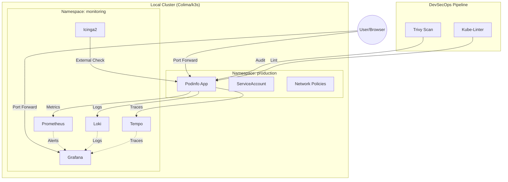

# EC Observability Hub


This project provides a robust observability stack (Prometheus, Loki, Tempo, Grafana, Icinga2, K6) running on a local Kubernetes cluster.

## Architecture Overview



## Features

- **Automated Infrastructure:** One-click deployment with Colima, k3s, and Helm.
- **Service Monitoring:** Custom Grafana dashboards (Cluster Overview, PodInfo).
- **Log Aggregation:** Loki for centralized log management.
- **Distributed Tracing:** Tempo for end-to-end request tracing and performance debugging.
- **External Monitoring:** Icinga2 for host/service checks.
- **Load Testing:** K6 with web UI for performance validation.
- **Resilience:** Liveness and Readiness probes for automated self-healing.
- **Auto-scaling:** Horizontal Pod Autoscaler (HPA) to handle traffic spikes.

## Getting Started

Initialize the infrastructure and deploy the stack:

```bash
make deploy
```

## URLs d'Accès

| Service | URL | Credentials |
|---------|-----|-------------|
| Grafana | http://localhost:3000 | admin / prom-operator |
| Prometheus | http://localhost:9090 | - |
| Loki | http://localhost:3100 | - |
| K6 Web UI | http://localhost:6565 | - |
| PodInfo App | http://localhost:9898 | - |
| Icinga2 API | localhost:5665 | - |

## Commandes Utiles

```bash
make deploy              # Déploiement complet
make scan                # Scanner les vulnérabilités (Trivy)
make access              # Ouvrir tous les port-forwards
make ports              # Afficher les URLs
make load-test          # Lancer les tests de charge
make k6-web             # Interface web K6
kubectl get pods -A       # Tous les pods
kubectl top pods -n monitoring  # Métriques en temps réel
colima status           # État du cluster
```

## Performance Validation

To simulate real-user traffic and observe the cluster's response (including auto-scaling and metric spikes), run the integrated load test:

```bash
make load-test
```

While the test is running, you can monitor the scaling behavior in your terminal:
```bash
kubectl get hpa -n app --watch
```

## Technical Architecture and Decisions

### 1. Observability: The 3 Pillars (Prometheus, Loki, Tempo)
Complete observability with:
- **Metrics (Prometheus):** Real-time performance indicators.
- **Logs (Loki):** Centralized log aggregation with direct correlation to traces.
- **Traces (Tempo):** Distributed tracing to visualize the request lifecycle across pods.
- **Grafana Visualization:** Unified dashboards with seamless navigation from Log to Trace.

### 2. Icinga2 for External Monitoring
Icinga2 provides enterprise-grade external monitoring for hosts and services, complementing Prometheus's metrics-based approach.

### 3. K6 for Performance Testing
K6 offers a developer-friendly load testing solution with both CLI and web UI. Perfect for validating system behavior under stress.

### 4. Resilience and Self-Healing
The deployment includes Liveness and Readiness probes. This ensures that traffic is only routed to healthy pods and that Kubernetes automatically restarts containers in case of failure.

### 5. Security & Compliance (DevSecOps)
- **Zero Trust Networking:** Network Policies with \`default-deny\` enforce strict isolation between namespaces and only allow authorized traffic (DNS, Monitoring, Apps).
- **Least Privilege RBAC:** Dedicated ServiceAccounts for applications, moving away from default permissions.
- **Pod Hardening:** SecurityContext enforces \`runAsNonRoot\`, drops all kernel capabilities, and prevents privilege escalation.
- **Automated Auditing:** Integrated \`make scan\` using **Trivy** to detect security misconfigurations in Kubernetes manifests.

### 6. Dynamic Scaling (HPA)
A Horizontal Pod Autoscaler is configured to scale the application from 2 to 5 replicas based on CPU utilization.

### 6. Resource Management
Optimized for 18GB RAM hosts, the stack uses resource limits and optimized container images for Apple Silicon.

## Future Roadmap (Production Readiness)

To transition this local prototype to a production-grade environment, the following enhancements are planned:

- **Infrastructure as Code (Terraform):** Replace manual cluster setup with Terraform providers (e.g., AWS EKS, Google GKE, or Azure AKS) to manage cloud resources and networking.
- **Configuration Management (Ansible):** Automate the baseline security and OS-level tuning for Kubernetes nodes.
- **CI/CD Integration:** Migrate the `Makefile` logic into GitHub Actions or GitLab CI for automated testing and deployment.
- **External Persistence:** Configure Loki and Prometheus to use object storage (like AWS S3 or Azure Blob Storage) for long-term log and metric retention.
- **Secrets Management:** Integrate with HashiCorp Vault or Cloud KMS instead of using hardcoded/dynamic terminal outputs for credentials.

## Cleanup

To stop the cluster:
```bash
make clean
```

To completely uninstall all tools and delete data:
```bash
make destroy
```
